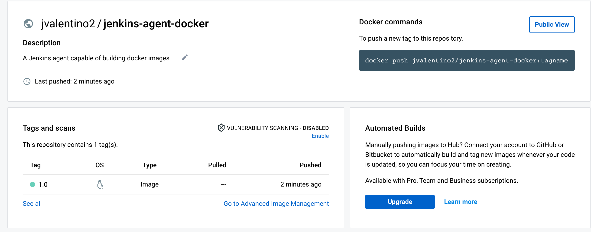
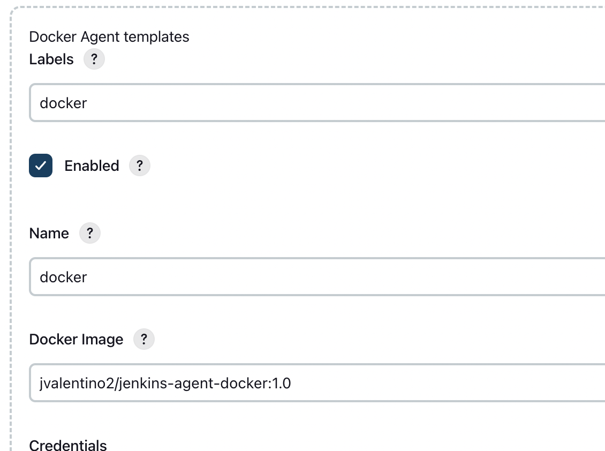
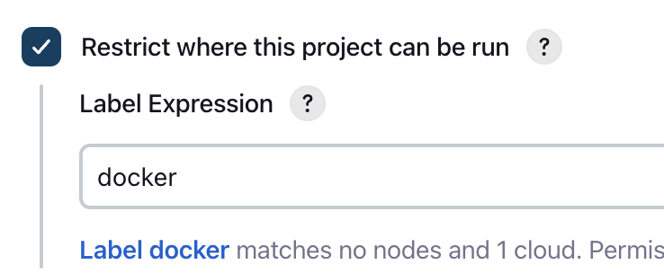
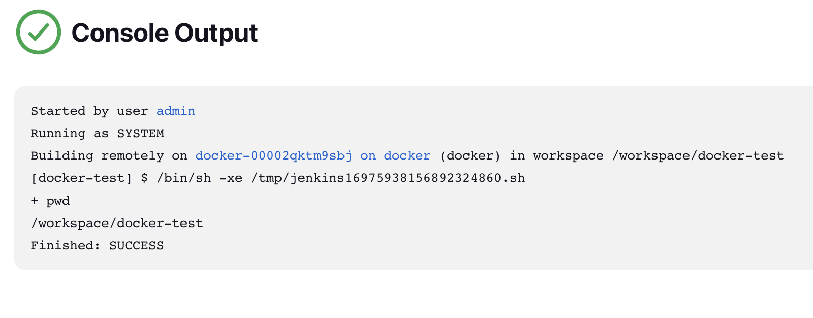

# Jenkins Docker Agent

This project represents a Jenkins agent capable of building docker images.

To be clear: This is running Jenkins in a Docker Container, which uses another Docker Container to host build agents as Docker Containers, where this agent is a container implementation capable of building Docker images, which is then used to build itself.

Yep, that doesn't make sense at all.

# Using it

First, you have to build it:

```bash
docker build -t jvalentino2/jenkins-agent-docker .
```

This will result in the local image of `jvalentino2/jenkins-agent-docker`.

...but now you have to publish it somewhere to pick it up. In my case, I am using Docker Hub, which means:

1. Create a Docker ID: https://docs.docker.com/docker-id/
2. Create a repository: https://docs.docker.com/docker-hub/repos/
3. Create a personal access token: https://docs.docker.com/docker-hub/access-tokens

You can then run these three commands to deploy it:

```bash
docker login --username $DOCKER_USERNAME --password $DOCKER_PASSWORD
docker tag jvalentino2/jenkins-agent-docker:latest jvalentino2/jenkins-agent-docker:1.0
docker push jvalentino2/jenkins-agent-docker:1.0
```

In my case I know that it worked, because I can see this version now on https://hub.docker.com/repository/docker/jvalentino2/jenkins-agent-docker:



## On Jenkins

If you are following along with JCASC (https://github.com/jvalentino/example-jenkins-docker-jcasc-2), you just then add a new agent:



**Note that you must select the box for it to be privaledged, otherwise dockerd won't start.**

`Run container privileged`

...which then needs to become a part of jenkins.yaml:

```yaml
  clouds:
  - docker:
      dockerApi:
        connectTimeout: 60
        dockerHost:
          uri: "tcp://socat:2375"
        readTimeout: 60
      name: "docker"
      templates:
      - connector:
          attach:
            user: "root"
        dockerTemplateBase:
          cpuPeriod: 0
          cpuQuota: 0
          image: "jenkins/agent"
        instanceCapStr: "0"
        labelString: "default"
        name: "default"
        pullStrategy: PULL_ALWAYS
        pullTimeout: 300
      - connector:
          attach:
            user: "root"
        dockerTemplateBase:
          cpuPeriod: 0
          cpuQuota: 0
          image: "jvalentino2/jenkins-agent-docker:1.0"
          privileged: true
        labelString: "docker"
        pullStrategy: PULL_ALWAYS
        pullTimeout: 300
```

You can then verify it works by using a test job with the `docker` label:





# Automate building it

Consider that you first have to build and deploy this manually, but after that you can build a pipeline to automate all this. Consider that it will be using the current version of itself to build a new version of itself.

I also could not igure out how to get dockerd (the docker daemon) to start as a part of the container, so I had to handle both starting and stopping it as a part of the build process:

```groovy
pipeline {
 agent { label 'docker' }

  stages {
    
    stage('Publish') {
      steps {
        withCredentials([usernamePassword(
        credentialsId: 'dockerhub', 
        passwordVariable: 'DOCKER_PASSWORD', 
        usernameVariable: 'DOCKER_USERNAME')]) {
            sh '''
                nohup dockerd &
                sleep 10
                docker build -t jvalentino2/jenkins-agent-docker .
                docker login --username $DOCKER_USERNAME --password $DOCKER_PASSWORD
                docker tag jvalentino2/jenkins-agent-docker:latest jvalentino2/jenkins-agent-docker:1.${BUILD_NUMBER}
                docker tag jvalentino2/jenkins-agent-docker:latest jvalentino2/jenkins-agent-docker:latest
                docker push jvalentino2/jenkins-agent-docker:1.${BUILD_NUMBER}
                docker push jvalentino2/jenkins-agent-docker:latest
                cat /var/run/docker.pid | xargs kill -9 || true
            '''
        }
      }
    } // Publish

  }
}
```

- I had to create a credential called dockerhub to store by ID and token for Dockerhub
- It uses the BUILD_NUMBER to come up with a unique version number every time it runs
- It starts dockerd, arbitrarily waits, continues on with the work, and then at the end kills dockerd
- There are also two images created for every run. The first is based on the build number, and the second is called "latest". That way if you refer to "latest" you will always get the current version.

# Working on it

I set this up so that I could run the container locally to verify that it all works.

This means that there are two steps to doing this:

## (1) Building the image

```bash
docker compose build
```

## (2) Running the container

```bash
docker compose run --rm jenkins_agent_docker
```

## (3) Verifying it works

Once in the container, you can then verify that docker works:

```bash
root@0bf88427da2a:/home/jenkins# docker run hello-world

Hello from Docker!
This message shows that your installation appears to be working correctly.

To generate this message, Docker took the following steps:
 1. The Docker client contacted the Docker daemon.
 2. The Docker daemon pulled the "hello-world" image from the Docker Hub.
    (arm64v8)
 3. The Docker daemon created a new container from that image which runs the
    executable that produces the output you are currently reading.
 4. The Docker daemon streamed that output to the Docker client, which sent it
    to your terminal.

To try something more ambitious, you can run an Ubuntu container with:
 $ docker run -it ubuntu bash

Share images, automate workflows, and more with a free Docker ID:
 https://hub.docker.com/

For more examples and ideas, visit:
 https://docs.docker.com/get-started/

root@0bf88427da2a:/home/jenkins# 
```

When you exit the container, the container is also shut down.

```bash
root@0bf88427da2a:/home/jenkins# exit
exit
~/workspaces/personal/jenkins-agent-docker $ 
```

## (4) Testing image building

Additionally I have inluded a workspace that you can verify that a build works:

```bash
root@dae975733446:/home/jenkins/workspace# docker build -t my_image .
[+] Building 0.1s (5/5) FINISHED                                                                             
 => [internal] load build definition from Dockerfile                                                    0.0s
 => => transferring dockerfile: 54B                                                                     0.0s
 => [internal] load .dockerignore                                                                       0.0s
 => => transferring context: 2B                                                                         0.0s
 => [internal] load metadata for docker.io/library/hello-world:latest                                   0.0s
 => CACHED [1/1] FROM docker.io/library/hello-world                                                     0.0s
 => exporting to image                                                                                  0.0s
 => => exporting layers                                                                                 0.0s
 => => writing image sha256:28109976132196580bf7c26b160365bfb99fa2cb7baa7eb039db2efd3d8244a7            0.0s
 => => naming to docker.io/library/my_image         
```

